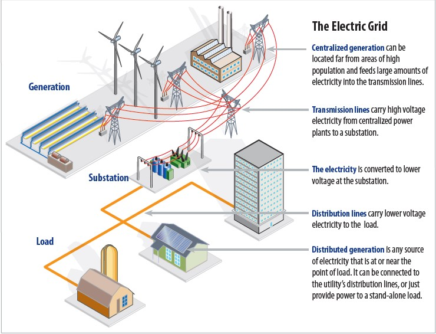

# Electric-Grid-Fault-Prediction
Machine Learning Model for prediction of fault in Electrical Grid

The amount of electricity fed into the electricity grid must always be equal to the amount of electricity consumed, otherwise there's a black-out.With the increase in renewable energy production, which varies greatly depending on the weather, may lead to black-out. 
This black-out will turn in to loss of generation which tends to reduce revenue of the company. Also very recently in Mar-22, CERC (Indian regulation authority) has notified regulation for power scheduling and forecasting, which will lead to penalty in case of under injection of energy in the grid as per scheduled energy.
For this problem, I have used data set from Kaggle. This data set contains various observations of different fault in combination of Voltage and Current. It is a multiclass problem. With the following classes

•	0 0 0 0 - No Fault

•	1 0 0 1 - LG fault (Between Phase A and Gnd)

•	0 1 1 0 - LL fault (Between Phase B and Phase C)

•	1 0 1 1 - LLG Fault (Between Phases A, B, and ground)

•	0 1 1 1 - LLL Fault(Between all three phases)

•	1 1 1 1 - LLLG fault( Three phase symmetrical fault)
